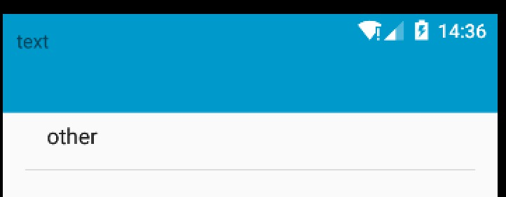

# windowmanger子视图置顶(从状态栏层布局)


### 效果图如下



### Code
```
int size=144;
WindowManager.LayoutParams params = new WindowManager.LayoutParams(
        WindowManager.LayoutParams.MATCH_PARENT,
        size,
        WindowManager.LayoutParams.TYPE_SYSTEM_ALERT, // z-ordering
        WindowManager.LayoutParams.FLAG_NOT_TOUCH_MODAL | WindowManager.LayoutParams.FLAG_NOT_FOCUSABLE,
        PixelFormat.TRANSLUCENT);
//下一句是关键        
params.systemUiVisibility=View.SYSTEM_UI_FLAG_LAYOUT_FULLSCREEN;

params.gravity = Gravity.TOP;
WindowManager mWindowManager = (WindowManager) getActivity().getSystemService(Context.WINDOW_SERVICE);
            mWindowManager.addView(view, params);
```


