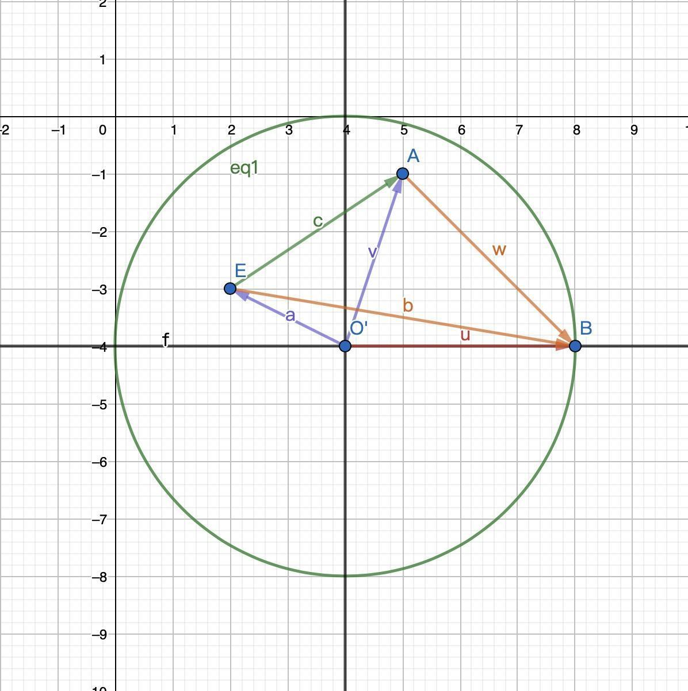

# 手势旋转(圆形).md



B为参照点,
O为中心点,
E为手势起点,
A为手势终点,


余弦定律表示：“三角形任意一边的平方等于另外两边的平方和减去二倍的这两边与他们的夹角的余弦的积”。

计算旋转角度:

1.分别计算:OA,OB,OE,EA,AB,EB的长度

2.计算cos(AOB)的值,使用acos求得AOB的角度
    根据上述定律:
```
pow(AB,2)=pow(OA,2)+pow(OB,2)-2*OA*OB*cos(AOB);
转变后
cos(AOB)=(pow(OA,2)+pow(OB,2)-pow(AB,2))/2*OA*OB

AOB=acos(cos(AOB))

```
3.根据2一样的步骤求得EOB的角度
4.EOB-AOB的差就是旋转的角度

5.计算时注意起点或终点在中心点Y轴的上方还是下方,上方取反,下方取正


类似实现
```dart
_rotateAngle() {
    var gestureDirection = 1;
    if (_startOffset.dy < _centerOffset.dy) {
      gestureDirection = -1;
    } else {
      gestureDirection = 1;
    }
    var _updateAngle = gestureDirection *
        _angle(_updateOffset, Offset(_centerOffset.dx + 100, _centerOffset.dy),
            _centerOffset);
    if (_updateOffset.dy < _centerOffset.dy) {
      gestureDirection = -1;
    } else {
      gestureDirection = 1;
    }
    var _startAngle = gestureDirection *
        _angle(_startOffset, Offset(_centerOffset.dx + 100, _centerOffset.dy),
            _centerOffset);
    return (_updateAngle - _startAngle);
  }

  _angle(_aPoint, _bPoint, _oPoint) {
    var _oALen =
        sqrt(pow(_aPoint.dx - _oPoint.dx, 2) + pow(_aPoint.dy - _oPoint.dy, 2));
    var _oBLen =
        sqrt(pow(_bPoint.dx - _oPoint.dx, 2) + pow(_bPoint.dy - _oPoint.dy, 2));
    var _aBLen =
        sqrt(pow(_aPoint.dx - _bPoint.dx, 2) + pow(_aPoint.dy - _bPoint.dy, 2));
    var _cosAngle =  (pow(_oALen, 2) + pow(_oBLen, 2) - pow(_aBLen, 2)) /
        (2 * _oALen * _oBLen);
    return acos(_cosAngle);
  }


```